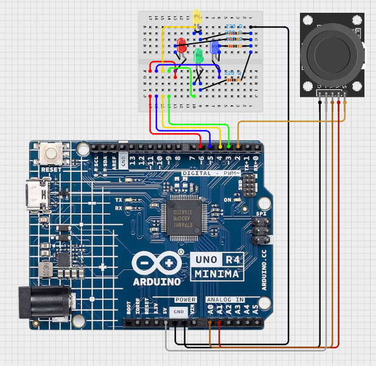

# **Pattern Matching Game on an Arduino UNO**
The classic pattern matching game of Simon Says where a sequence is presented and the player's goal is to mimic the sequence from their memory.

## Gameplay Mechanics
Each LED represents a direction:
	Yellow: UP
	Green: DOWN
	Red: LEFT
	Blue: RIGHT

The game presents a random sequence it wants the player to copy through lighting the LEDs. After the sequence is presented, the player uses the joystick to mimic the pattern from their memory. 

The game gets progressively harder as the player passes each level by adding an additional step to the next randomly generated sequence (level). On a failed attempt, the game resets to level 1.

https://github.com/user-attachments/assets/cbceb209-5688-4b7f-9bde-5de95d6bcd80
#### Motivation for building this
I just got this Arduino UNO 3 days ago since I've taken an interest into doing hardware projects. I did a couple of tutorials it came with to turn an LED on and off using a push button which got me hooked. So I decided I wanted to build a tiny 1-day project of my own using the basics I learnt. I know next to nothing about electronics, so I thought this pattern matching game would be the right size with the help of a friend that knows more about circuits.

## Hardware Requirements
- Arduino UNO
- Joystick module
- 4x LEDs
- 4x 100/220 Ohm Resistors
- 5x M-F Wires
- 5x M-M Wires
- Breadboard

# Wiring Diagram

## How to Play
Start the game by supplying power, or if already powered, then hit the red reset button on the Arduino.

Watch the lights for when only one LED comes on at a time and start remembering the order. After all lights stay dark, it's the player's turn to remember the sequence that just played and input the right directions. 

If the player gets a step in the sequence correct, the light corresponding to the direction input will blink once. 

If the player gets a step wrong all lights will flash and the game will reset to level 1.

Have fun!
### Game Starting
https://github.com/user-attachments/assets/6df3a810-a604-477c-a0d1-7362eff2caff
## Future Improvements
#### Gameplay
- Further increase difficulty in each level by shortening the time between each LED blink in the sequence.
- Diagonal inputs: Allow adjacent LEDs (up and left) to blink together to indicate the player must input a diagonal input.
- Sound: Add a little speaker to play win/lose sounds for a better experience
- Joystick button: Find a creative way to implement the joystick's built-in button.

#### Implementation Details
`getStickDirection()`
- Better evaluate diagonal inputs. Current function evaluate the X and Y positions sequentially so there is a bias to the positions that are evaluated first.

--
p.s. Thanks to my buddy David for helping me with the curcuit implementation and answering "which pin on the LED is negative?" about 100 times.

